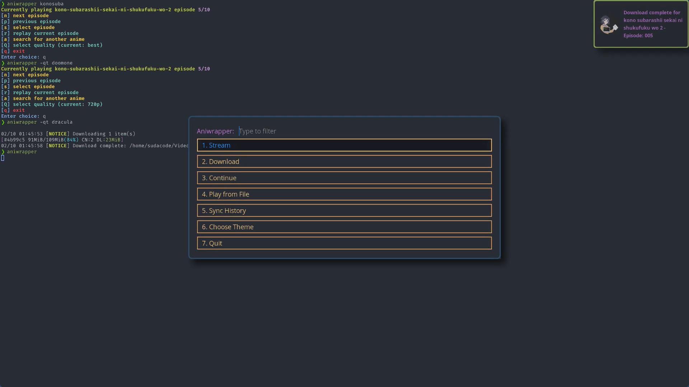

<div align="center">

# Aniwrapper

[**_Setup_**](#setup) | [**_Usage_**](#usage) | [**_Screenshots_**](#screenshots)

[](https://user-images.githubusercontent.com/33813108/153382027-f77c8219-af79-4a06-91b2-466cc7e2157a.mp4)

</div>

# Introduction

This is a fork of [Dink4n's ani-cli](https://github.com/Dink4n/ani-cli),
which itself is a fork of
pystardust's [old-ani-cli](https://github.com/pystardust/ani-cli/tree/old-ani-cli)

This fork is a wrapper around a modified version of ani-cli, which uses [rofi](https://github.com/davatorium/rofi)
to gather information and control the program flow.
In addition to `rofi`, I've also changed the way saving history works by
integrating a local [sqlite3](https://www.sqlite.org/index.html) database with a table for
search, watch, and file history

While this is a fork of a fork of pystardust's old-ani-cli, I would call this more of a light fork of the [the main ani-cli](https://github.com/pystardust/ani-cli).
I have implemented most of the main features from the original script and continue to use the same scraping logic

This tool scrapes the site [gogoanime](https://gogoanime.cm).

<!-- markdown-toc start - Don't edit this section. Run M-x markdown-toc-refresh-toc -->

**Table of Contents**

- [Aniwrapper](#aniwrapper)
- [Introduction](#introduction)
- [MPV Extension - Skip Intro Script](#mpv-extension---skip-intro-script)
- [Installing](#installing)
  - [Manual Install](#manual-install)
- [Aniwrapper Menus](#aniwrapper-menus)
- [Dealing with conflicting search queries / rofi grabbing from search list](#dealing-with-conflicting-search-queries--rofi-grabbing-from-search-list)
- [Usage](#usage)
  - [aniwrapper](#aniwrapper-1)
    - [Option 1: Streaming](#option-1-streaming)
    - [Option 2: Download](#option-2-download)
    - [Option 3: Continue](#option-3-continue)
    - [Option 4: Play from File](#option-4-play-from-file)
    - [Option 5: Sync History](#option-5-sync-history)
    - [Option 6: Choose Theme](#option-6-choose-theme)
  - [ani-cli](#ani-cli)
- [Themes](#themes)

<!-- markdown-toc end -->

# MPV Extension - Skip Intro Script

_This repo comes packaged with and will install the
[skip-intro.lua](https://github.com/rui-ddc/skip-intro)
script for MPV during setup if it is not already installed_

**The script is activated with the `TAB` key**

Upon activation, the skip-intro script will try its best to skip the
episode introduction by skipping to the next moment of silence in the video

- If the video has not pre-loaded past the introduction, the script will not
  know what to do. Press `TAB` again to stop the script until the video
  has loaded enough, or just manually skip past the intro.
- If the video does not have a pause in audio (or a significant enough drop in
  audio volume) between the end of the introduction and the beginning of the
  video/episode, then the script may fail and skip to a random point in the
  video

# Installing

These are the minimum dependences required to run `aniwrapper`

```
axel curl ffmpeg grep mpv rofi sed sqlite3
```

**Arch Linux**

`aniwrapper-git` is available on the [AUR](https://aur.archlinux.org/packages/aniwrapper-git/) for Arch users

```sh
paru -S aniwrapper-git
or
yay -S aniwrapper-git
```

## Manual Install

Install the Dependencies

```sh
# Arch
pacman -S --needed axel curl ffmpeg grep mpv rofi sed sqlite3

# Debian
apt install axel curl ffmpeg grep mpv rofi sed sqlite3
```

Clone and switch into the repo directory

```sh
git clone https://github.com/ksyasuda/aniwrapper && cd aniwrapper
```

Then, from the `aniwrapper` directory, run the following commands to set up and install the script

```sh
chmod +x setup.sh
./setup.sh && sudo make install
```

# Aniwrapper Menus

See [aniwrapper menus](docs/aniwrapper-menus.md)

# Dealing with conflicting search queries / rofi grabbing from search list

In this program, rofi is configured to search with case insensitivity and select the best match from the list if there are matches. This can make it difficult at times to write a search query that does not trigger a selection from the rofi menu

<div align="center">


Once your history starts filling up, it becomes progressively more difficult to form unique search queries


A workaround for this is to append a dash `-` to the end of the search query<br/>
The above output was produced by searching: `isekai -`

</div>

# Usage

## aniwrapper

```
aniwrapper [-cdhpqSv] [-t <theme> or -T <config_path>] <query>
aniwrapper [-cpqSv] [-t <theme> or -T <config_path>] -f <path_to_directory>
aniwrapper -Q <query>
aniwrapper -C

aniwrapper <query> # Run in stream mode, searching for <query>
aniwrapper -c # Use ani-cli command-line mode (rofi disabled)
aniwrapper -C # Connect to history database
aniwrapper -d # Download anime in command-line mode
aniwrapper -d <query> # Run in download mode (best quality), searching for <query>
aniwrapper -e <episode> or <"begin_episode - end_episode">
aniwrapper -f <starting_directory> # Specify starting directory for play_from_file mode, bypassing main menu
aniwrapper -h # Show help menu
aniwrapper -p # Enable player selection menu
aniwrapper -q # Launch menu with quality selection
aniwrapper -Q <query> # Query the history database
aniwrapper -r # Launch aniwrapper in quick-resume mode (start script on episode selection for the most recently streamed anime)
aniwrapper -S # Enable silent mode (suppress output to stdout) [cannot be used with -v]
aniwrapper -t <theme> # Choose rofi theme from presets
aniwrapper -T <path_to_config> # Specify custom rofi config
aniwrapper -v # Enable verbose logging
```

See [aniwrapper menus](docs/aniwrapper-menus.md) for more information about the menus used in the following options

### Option 1: Streaming

Streaming is the default option for the `aniwrapper` script

<details>

<summary>Example</summary>

<div align="center">


</div>

</details>

### Option 2: Download

The default download location is `$HOME/Videos/sauce` and will be chosen as the download directory unless otherwise specified

<details>

<summary>Example</summary>

<div align="center">


</div>

</details>

### Option 3: Continue

The continue option queries the `sqlite3` history databse and pulls the list of distinct anime names from the `watch_history` table. Select an option from the list and the most recently watched episode of the selected anime will play

<details>

<summary>Example</summary>

<div align="center">


</div>

</details>

### Option 4: Recently Updated Anime

This option will present the name and episode number of 30 recently updated anime on gogoanime

<details>
<summary>Example</summary>

<div align="center">


</div>

</details>

### Option 5: Play from File

<details>

<summary>Example</summary>

<div align="center">


</div>

</details>

### Option 6: Sync History

This option allows you to sync your search/watch history across devices. It queries the database on the remote machine and inserts/updates the necessary rows

At the moment, the requirements are as follows:

- You must be able to `ssh` into the remote machine
- The username must be the same across both devices
- The `history.sqlite3` file must be in the default location: `$XDG_CONFIG_HOME/aniwrapper/history.sqlite3`

### Option 7: Choose Theme

Change aniwrapper theme

<details>

<summary>Example</summary>

<div align="center">


</div>

</details>

# Themes

<div align="center">

Default theme


|                                                                                                                                                                                                                            |                                                                                                                                                                                                                                 |
| :------------------------------------------------------------------------------------------------------------------------------------------------------------------------------------------------------------------------: | :-----------------------------------------------------------------------------------------------------------------------------------------------------------------------------------------------------------------------------: |
|   <details><summary>alter</summary>  </details>    | <details><summary>aniwrapper</summary>  </details> |
| <details><summary>doom-one</summary>  </details> |    <details><summary>dracula</summary> </details>     |
|    <details><summary>fancy</summary></details>     |    <details><summary>material</summary></details>    |
|  <details><summary>monokai</summary></details>   |        <details><summary>nord</summary></details>        |
|    <details><summary>nord2</summary></details>     |     <details><summary>onedark</summary></details>     |

</div>
