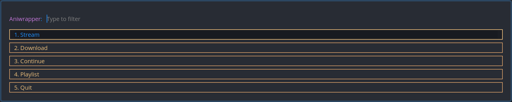
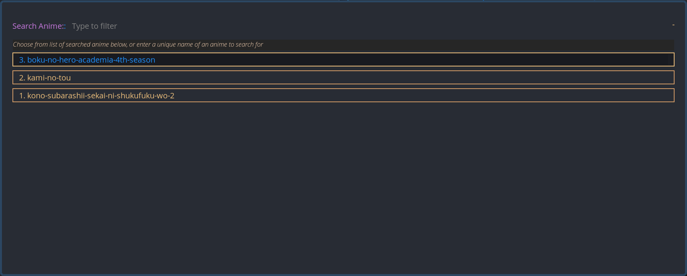

<div align="center">

# Aniwrapper

[Setup](#setup) | [Usage](#usage) | [Screenshots](#screenshots)



</div>

<!-- markdown-toc start - Don't edit this section. Run M-x markdown-toc-refresh-toc -->

**Table of Contents**

- [Aniwrapper](#aniwrapper)
- [Introduction](#introduction)
- [Setup](#setup)
  - [Dependencies](#dependencies)
    - [Arch Linux](#arch-linux)
  - [Installing](#installing)
  - [`aniwrapper` Menus](#aniwrapper-menus)
    - [Search Anime](#search-anime)
    - [Anime Selection](#anime-selection)
    - [Episode Selection](#episode-selection)
- [Usage](#usage)
  - [aniwrapper](#aniwrapper)
    - [Option 1: Streaming](#option-1-streaming)
    - [Option 2: Download](#option-2-download)
    - [Option 3: Continue](#option-3-continue)
    - [Option 4: Playlist](#option-4-playlist)
  - [ani-cli Script](#ani-cli-script)
- [Screenshots](#screenshots)

<!-- markdown-toc end -->

---

# Introduction

This is a fork of [Dink4n's ani-cli](https://github.com/Dink4n/ani-cli),
which itself is a fork of
pystardust's [old-ani-cli](https://github.com/pystardust/ani-cli/tree/old-ani-cli)

This fork is a wrapper around a modified version of ani-cli
and uses [rofi](https://github.com/davatorium/rofi) to gather information and control the program

In addition to `rofi`, I've also changed the way saving history works by
integrating a local [sqlite3](https://www.sqlite.org/index.html) database with a table for
search and watch history

It is built around Dink4n's fork of ani-cli since at the time of
creation, this is the version that has downloading working correctly

This tool scrapes the site [gogoanime](https://gogoanime.vc).

It is intended to be called from the wrapper script `aniwrapper`,
however using the ani-cli script itself is also possible

# Setup

## Dependencies

These are the minimum dependences required to run `aniwrapper`

- grep
- curl
- sed
- mpv
  - skip-intro.lua (installed in setup.sh)
- ffmpeg
- rofi
  - meh.rasi (installed in setup.sh)
- sqlite3

### Arch Linux

```sh
pacman -S --needed grep curl sed mpv ffmpeg rofi sqlite3
```

## Installing

```sh
git clone https://github.com/ksyasuda/aniwrapper
cd aniwrapper
```

After cloning and switching into the `aniwrapper` directory, run the following commands to set up and install the script

```sh
chmod +x setup.sh
./setup.sh && sudo make install
```

## `aniwrapper` Menus

There are several menus used to drive the program forward

### Search Anime

The first menu consists of a search box and a list of anime titles corresponding to past valid searches. Choose an option from the menu, or enter in a unique search query to search for a new anime. The result from this will be used to query against `gogoanime` and return similar named anime

### Anime Selection

The next menu is where you select the anime to watch from a narrowed down list. Elements that have a blue border and text color indicate which anime have been watched before

- _In the future, I'd like to make it so if you select an option from the list of previously searched anime, then it will skip this and go on to episode selection_

### Episode Selection

In the episode selection menu, you can select an individual episode from the list, provide a single episode, or provide a range of episodes as two space separated integers `start_episode end_episode`. Like in the previous menu, any element with a blue border and text-color indicates that episode has been watched before

# Usage

## aniwrapper

    # Launch aniwrapper menu
    aniwrapper

### Option 1: Streaming

<div align="center">


Streaming a previously watched anime
[click here](./assets/gifs/streaming_new.gif) for an example showing streaming a new anime

</div>

Streaming is the default option for the `aniwrapper` script and will prompt you with each of the menus specified in the _[aniwrapper Menus](#aniwrapper-menus)_ section

### Option 2: Download

The default download location is `$HOME/Videos/sauce` and will be chosen as the download directory unless otherwise specified

After specifying the download directory (or leaving it blank for the default), you will be presented with the menus from the _[aniwrapper Menus](#aniwrapper-menus)_ section for selecting the anime and episode(s) to download

### Option 3: Continue

**CURRENTLY BROKEN. WORKING ON FIX**

The continue option queries the `sqlite3` history databse and pulls the list of distinct anime names from the `watch_history` table. Select an option from the list and the most recently watched episode of the selected anime will play

### Option 4: Playlist

_description coming soon_

## ani-cli Script

    # watch anime
    ani-cli <query>

    # download anime
    ani-cli -d <download_directory>

    # resume watching anime
    ani-cli -H

    # list searched anime
    ani-cli -l

    # add to playlist
    ani-cli -a

    # delete from playlist
    ani-cli -d

    # playlist mode
    ani-cli -P

Multiple episodes can be viewed/downloaded by giving the episode range like so

    Choose episode [1-13]: 1 6

This would open/download episodes 1 2 3 4 5 6

# Screenshots

<div align="center">

Aniwrapper Main Menu

Aniwrapper Streaming Menu

More to come soon... maybe

</div>
